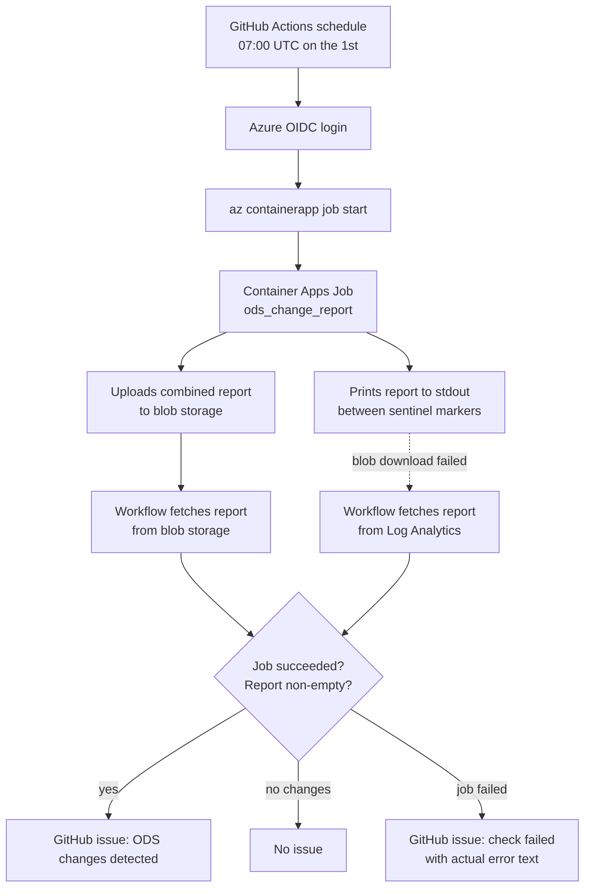

# ODS change detection

The `ods-change-detection.yml` GitHub workflow runs the ODS change-detection
checks on a monthly schedule (07:00 UTC on the 1st of the month) and opens a
GitHub issue listing what would change if the sync were applied. This gives
the team a human-in-the-loop review step before any automatic write touches
the temporal layer, and surfaces mergers and updates that ODS has published
without anyone having to watch the API manually.

## Why the checks run in Azure

The dry-run checks compare the NHS ODS API against the **production**
database, which is only reachable from inside the Azure Container Apps
environment. GitHub-hosted runners cannot reach the database, so the checks
run in an **Azure Container Apps Job** that uses the same image and runtime
secrets as the live app. The GitHub workflow is only the scheduler and the
issue creator:



## The three checks

The job runs `python manage.py ods_change_report`, which runs, in order:

1. `cron --service organisations --dry-run` — the ODS `/sync` endpoint for
   recent changes (trusts + organisations).
2. `backfill_successions --entity trust --dry-run` — the
   `/organisations/{ods_code}` Succs block for every trust, reporting missing
   `TrustSuccession` rows.
3. `backfill_successions --entity icb --dry-run` — the Succs block for every
   ICB, reporting missing `IntegratedCareBoardSuccession` rows and missing
   successor ICBs (e.g. the 2026 ICB reorganisation).

Each check writes its clean markdown report to a temp file via `--report-file`
(no banners, summaries, ASCII art or ANSI colour codes), then the command
combines the non-empty reports under `##` section headings, prints the result
between the `<<<ODS_REPORT_START>>>` / `<<<ODS_REPORT_END>>>` sentinel
markers on stdout (so it can also be read in the job's console logs), and
uploads it to Azure Blob Storage. The workflow downloads the blob and opens
an issue if the report is non-empty.

If any check raises, the error is recorded, the remaining checks still run, a
`Check failures` section is appended, and the command exits non-zero so the
job execution is marked `Failed`. The workflow then opens a
"ODS change detection failed" issue instead of a "changes detected" issue —
a failed check must never look like "no changes".

## One-off job setup

Create the job in the same Container Apps environment as the live app, with
the same runtime secrets and env vars (Container Apps secrets are per
app/job, so the values are copied from the live app):

```bash
# 1. Read the live app's secret values and env-var bindings
az containerapp secret list \
    --name <live-app-name> --resource-group <resource-group> -o json
az containerapp show \
    --name <live-app-name> --resource-group <resource-group> \
    --query "properties.template.containers[0].env" -o table

# 2. Create the job with the same values. The live image is in Azure
#    Container Registry (s/ci pushes to <registry>.azurecr.io), so the job
#    needs pull credentials — prefer a managed identity with the AcrPull
#    role over registry admin credentials.
az containerapp job create \
    --name ods-change-detection \
    --resource-group <resource-group> \
    --environment <container-apps-environment> \
    --image <registry>.azurecr.io/<live-app-name>-django:<current-live-sha> \
    --registry-server <registry>.azurecr.io \
    --registry-identity <managed-identity-resource-id> \
    --trigger-type Manual \
    --replica-timeout 1800 \
    --cpu 1.0 --memory 2Gi \
    --secrets <same name>=<same value> ... \
    --env-vars <VAR>=secretref:<same secret-name> ... \
        ODS_REPORT_STORAGE_ACCOUNT_NAME=<storage-account-name> \
        ODS_REPORT_CONTAINER_NAME=ods-change-reports \
    --command "python" "manage.py" "ods_change_report"
```

The env vars the job needs (from `settings.py` and `ods_update.py`):
`RCPCH_NHS_ORGANISATIONS_SECRET_KEY`, `POSTGRES_DB`, `POSTGRES_USER`,
`POSTGRES_PASSWORD`, `POSTGRES_HOST`, `POSTGRES_PORT`, `NHS_ODS_API_URL`,
plus the report upload vars `ODS_REPORT_STORAGE_ACCOUNT_NAME` (required),
`ODS_REPORT_CONTAINER_NAME` (default `ods-change-reports`) and
`ODS_REPORT_BLOB_NAME` (default `ods-change-report.md`). HTTP-only settings
(`DJANGO_ALLOWED_HOSTS`, CSRF origins) are irrelevant to a job.

> **Note:** Container Apps secrets and env vars are scoped per app/job —
> they are **not** shared across a Container Apps environment. The job needs
> its own copy of every value; the commands above read them from the live
> app so nothing is retyped.

Prerequisites:

- **A storage account for the report** — the job uploads the combined report
  to a blob container (`ods-change-reports`) and the workflow downloads it.
  The job's managed identity needs the **Storage Blob Data Contributor**
  role on the account, and the GitHub OIDC identity (the one behind
  `AZURE_CLIENT_ID`) needs **Storage Blob Data Reader**.
- **Log Analytics Reader for the GitHub OIDC identity** — when the blob
  download fails (e.g. the job's upload failed because of a missing env var
  or a managed identity issue), the workflow falls back to fetching the job's
  console logs from the Log Analytics workspace attached to the Container
  Apps environment. The GitHub OIDC identity needs **Log Analytics Reader**
  on the workspace for this fallback to work. Without it, the failure issue
  will say "could not retrieve the job's report automatically" and point to
  the Azure portal.
- **The job needs ACR pull credentials** — the live image is private. Give a
  managed identity the `AcrPull` role on the registry and pass it via
  `--registry-identity`, or use registry admin credentials via
  `--registry-username` / `--registry-password`.
- **The GitHub OIDC identity needs job permissions** — the workflow starts
  and monitors the job and `s/ci` updates its image, so the identity behind
  `AZURE_CLIENT_ID` needs the **Container Apps Jobs Contributor** role,
  scoped to the job (or its resource group). Without it the workflow fails
  with `AuthorizationFailed` on `Microsoft.App/jobs/start/action`.
- The job is triggered `Manual` and started by the GitHub workflow — the
  schedule lives in `ods-change-detection.yml`, not in Azure.

### Keeping the job image in sync

`s/ci` updates the job's image to the same immutable `sha-<commit>` tag as
the live app on every deploy, so the checks always run the code that is in
production. If the job does not exist yet, the deploy skips the sync rather
than failing.

## Manual run

```bash
# Start the job on demand (e.g. after a suspected ODS incident)
az containerapp job start \
    --name ods-change-detection \
    --resource-group <resource-group>

# Follow the execution status
az containerapp job execution list \
    --name ods-change-detection \
    --resource-group <resource-group> -o table
```

Or use the **Run workflow** button on the
`ods-change-detection` workflow in the Actions tab (`workflow_dispatch`).

## Troubleshooting

| Symptom | Likely cause |
|---|---|
| Failure issue says "report source: none" | The blob download failed AND the Log Analytics fallback failed. Check: (1) the GitHub OIDC identity has Storage Blob Data Reader on the storage account, (2) the GitHub OIDC identity has Log Analytics Reader on the workspace, (3) `ODS_REPORT_STORAGE_ACCOUNT_NAME` repo variable is set. |
| Failure issue says "report source: blob" | The job uploaded the report but a check failed — the `## Check failures` section of the report (included in the issue) names the check and the error. |
| Failure issue says "report source: logs" | The blob download failed but the workflow retrieved the job's stdout from Log Analytics — the issue contains the full job output including the error. |
| Job log shows "ODS_REPORT_STORAGE_ACCOUNT_NAME is not set" | `ODS_REPORT_STORAGE_ACCOUNT_NAME` env var not set on the job — the command now fails loudly instead of silently skipping the upload. |
| Job log shows "SystemCheckError: System check identified some issues" | A Django system check is failing at startup (e.g. `4_0.E001` — `CSRF_TRUSTED_ORIGINS` values must start with `http://` or `https://`). This kills `manage.py` before the command runs. Check `DJANGO_CSRF_TRUSTED_ORIGINS` and `DJANGO_ALLOWED_HOSTS` on the job's env vars. |
| Log Analytics query returns no logs for the job | The query may be filtering on `ContainerAppName_s`, which is **empty** for Container Apps Jobs. Use `ContainerJobName_s` instead — the job name is there. |
| Workflow fails at "Start ODS change detection job" | The job does not exist (create it — see one-off setup) or its name does not match `ods-change-detection`. |
| "ODS change detection failed" issue | One of the three checks raised, or the report upload itself failed — the issue body contains the actual error text from the job's report or stdout. |