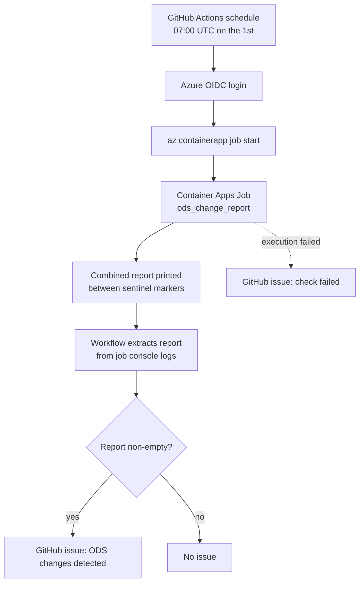

# ODS change detection

The `ods-change-detection.yml` GitHub workflow runs the ODS change-detection
checks on a monthly schedule (07:00 UTC on the 1st of the month) and opens a
GitHub issue listing what would change if the sync were applied. This gives
the team a human-in-the-loop review step before any automatic write touches
the temporal layer, and surfaces mergers and updates that ODS has published
without anyone having to watch the API manually.

## Why the checks run in Azure

The dry-run checks compare the NHS ODS API against the **production**
database, which is only reachable from inside the Azure Container Apps
environment. GitHub-hosted runners cannot reach the database, so the checks
run in an **Azure Container Apps Job** that uses the same image and runtime
secrets as the live app. The GitHub workflow is only the scheduler and the
issue creator:



## The three checks

The job runs `python manage.py ods_change_report`, which runs, in order:

1. `cron --service organisations --dry-run` — the ODS `/sync` endpoint for
   recent changes (trusts + organisations).
2. `backfill_successions --entity trust --dry-run` — the
   `/organisations/{ods_code}` Succs block for every trust, reporting missing
   `TrustSuccession` rows.
3. `backfill_successions --entity icb --dry-run` — the Succs block for every
   ICB, reporting missing `IntegratedCareBoardSuccession` rows and missing
   successor ICBs (e.g. the 2026 ICB reorganisation).

Each check writes its clean markdown report to a temp file via `--report-file`
(no banners, summaries, ASCII art or ANSI colour codes), then the command
combines the non-empty reports under `##` section headings and prints the
result between the `<<<ODS_REPORT_START>>>` / `<<<ODS_REPORT_END>>>` sentinel
markers on stdout. The workflow extracts the text between the markers from
the job's console logs and opens an issue if it is non-empty.

If any check raises, the error is recorded, the remaining checks still run, a
`Check failures` section is appended, and the command exits non-zero so the
job execution is marked `Failed`. The workflow then opens a
"ODS change detection failed" issue instead of a "changes detected" issue —
a failed check must never look like "no changes".

## One-off job setup

Create the job in the same Container Apps environment as the live app, with
the same runtime secrets and env vars (Container Apps secrets are per
app/job, so the values are copied from the live app):

```bash
# 1. Read the live app's secret values and env-var bindings
az containerapp secret list \
    --name <live-app-name> --resource-group <resource-group> -o json
az containerapp show \
    --name <live-app-name> --resource-group <resource-group> \
    --query "properties.template.containers[0].env" -o table

# 2. Create the job with the same values. The live image is in Azure
#    Container Registry (s/ci pushes to <registry>.azurecr.io), so the job
#    needs pull credentials — prefer a managed identity with the AcrPull
#    role over registry admin credentials.
az containerapp job create \
    --name <live-app-name>-ods-check \
    --resource-group <resource-group> \
    --environment <container-apps-environment> \
    --image <registry>.azurecr.io/<live-app-name>-django:<current-live-sha> \
    --registry-server <registry>.azurecr.io \
    --registry-identity <managed-identity-resource-id> \
    --trigger-type Manual \
    --replica-timeout 1800 \
    --cpu 1.0 --memory 2Gi \
    --secrets <same name>=<same value> ... \
    --env-vars <VAR>=secretref:<same secret-name> ... \
    --command "python" "manage.py" "ods_change_report"
```

The env vars the job needs (from `settings.py` and `ods_update.py`):
`RCPCH_NHS_ORGANISATIONS_SECRET_KEY`, `POSTGRES_DB`, `POSTGRES_USER`,
`POSTGRES_PASSWORD`, `POSTGRES_HOST`, `POSTGRES_PORT`, `NHS_ODS_API_URL`.
HTTP-only settings (`DJANGO_ALLOWED_HOSTS`, CSRF origins) are irrelevant to a
job.

Prerequisites:

- **Console logging (Log Analytics) must be enabled on the Container Apps
  environment** — `az containerapp job logs show` reads the job's console
  logs from it. Without it the workflow cannot retrieve the report.
- **The job needs ACR pull credentials** — the live image is private. Give a
  managed identity the `AcrPull` role on the registry and pass it via
  `--registry-identity`, or use registry admin credentials via
  `--registry-username` / `--registry-password`.
- The job is triggered `Manual` and started by the GitHub workflow — the
  schedule lives in `ods-change-detection.yml`, not in Azure.

### Keeping the job image in sync

`s/ci` updates the job's image to the same immutable `sha-<commit>` tag as
the live app on every deploy, so the checks always run the code that is in
production. If the job does not exist yet, the deploy skips the sync rather
than failing.

## Manual run

```bash
# Start the job on demand (e.g. after a suspected ODS incident)
az containerapp job start \
    --name <live-app-name>-ods-check \
    --resource-group <resource-group>

# Follow the execution status
az containerapp job execution list \
    --name <live-app-name>-ods-check \
    --resource-group <resource-group> -o table
```

Or use the **Run workflow** button on the
`ods-change-detection` workflow in the Actions tab (`workflow_dispatch`).

## Troubleshooting

| Symptom | Likely cause |
|---|---|
| Workflow fails at "Fetch job logs and extract report" | Console logging (Log Analytics) not enabled on the Container Apps environment. |
| Workflow fails at "Start ODS change detection job" | The job does not exist (create it — see one-off setup) or its name does not match `<live-app-name>-ods-check`. |
| Issue opened every month with no changes | Log-line prefixes are leaking into the extracted report — check the job's console log format. |
| "ODS change detection failed" issue | One of the three checks raised — the `Check failures` section of the job's stdout names the check and the error. |