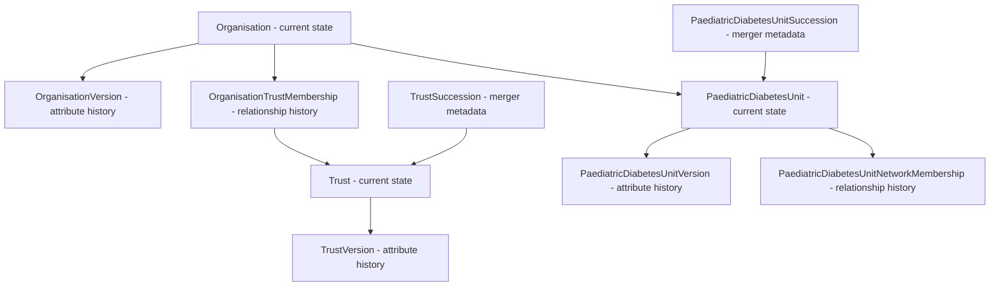

# Temporal history and merger tracking

## Background and motivation

The RCPCH NHS Organisations API is consumed by national audits (e.g. NPDA) that report
longitudinal data — outcomes are reported against the organisational geography that was
in force at the time the data was collected. NHS organisational structures are not
stable: trusts merge, are renamed, change ICB, or close; ICBs themselves were
reorganised in 2022 (CCGs → ICBs); Paediatric Diabetes Units (PDUs) can also merge.

Until now the database has stored only **current state**. The `Organisation.trust`
foreign key is overwritten on a merger, and
`update_organisation_model_with_ORD_changes()` overwrites `name`, `address`, etc. in
place. Once overwritten, the previous state is unrecoverable.

This document describes a hand-rolled temporal layer that captures every state change
from the point of installation forward, so that the API can answer:

> "On date X, which Trust / ICB / NHS England Region / OPEN UK Network / PDU was
> organisation Y under, and what was its name and address?"

## Scope

### In scope

- Temporal versioning of entity attributes (name, address, active flag) for:
  `Organisation`, `Trust`, `LocalHealthBoard`, `IntegratedCareBoard`,
  `NHSEnglandRegion`, `PaediatricDiabetesUnit`, `PaediatricDiabetesNetwork`.
- Temporal versioning of relationships (foreign keys that can be re-pointed) for:
  org → trust, org → LHB, org → ICB, org → NHS England region, org → OPEN UK network,
  org → PDU, PDU → network, and (if needed) org → London borough / LAD / LSOA.
- Explicit succession metadata for mergers, acquisitions, renames, closures, and
  splits — for both Trusts and PDUs.
- A read API endpoint that returns the full snapshot of an organisation at a given
  date.
- A backfill strategy that captures current state as the baseline and recovers the
  last 185 days of changes from the ODS `/sync` endpoint.

### Out of scope

- Recovering state from before installation day. The ODS `/sync` endpoint only
  surfaces the last 185 days of changes; older history is not queryable via the API
  and would require a one-off import from ODS Trac bulk dumps. That is a separate
  project if needed.
- Live querying of ODS at request time. ODS remains a *source* used to keep the local
  database current; it is not a query target for audit data.
- Versioning of relationships that essentially never change (e.g. country). These
  can be added later if required.

## Why hand-rolled rather than `django-simple-history`

A hand-rolled solution is preferred because:

- **Schema control.** The succession tables carry `succession_type` and `notes` —
  business metadata that does not fit cleanly into a generic history table.
- **Queryable relationships.** Audit reports need queries like "list all
  organisations that were under Trust X on date Y". A dedicated membership table
  makes this a single indexed join; a generic history table would require filtering
  on a stored FK id column with no relationship semantics.
- **No external dependency.** No upgrade risk, no behaviour drift between releases.
- **Explicit write path.** Every state change goes through a small set of helper
  functions, which makes the audit trail of *how* history was written reviewable.

The cost is more models, more migrations, and more helper code — but it is all
boilerplate, written once.

## Design

The design separates **entity snapshots** (what an entity's own attributes were over
time) from **relationship snapshots** (what an entity's parent was over time). These
have different timelines — an organisation can change address without changing trust,
and can change trust without changing address — so they are modelled separately.

The existing main tables (`Organisation`, `Trust`, etc.) continue to represent
**current state** and are unchanged in shape. The temporal layer is purely additive:
existing serializers, views, and API responses are unaffected.



### Layer 1 — Entity version tables

One append-only table per entity whose own attributes can change. Each row represents
a state of the entity that was valid over a `[valid_from, valid_to)` interval. The
current state is the row with `valid_to IS NULL`.

```python
class OrganisationVersion(TimeStampAbstractBaseClass):
    organisation = models.ForeignKey(
        "hospitals.Organisation",
        on_delete=models.CASCADE,
        related_name="versions",
    )
    valid_from = models.DateField()
    valid_to = models.DateField(null=True, blank=True)  # null = current

    # Snapshot of mutable attributes
    name = models.CharField(max_length=100, null=True, blank=True)
    address1 = models.CharField(max_length=100, null=True, blank=True)
    address2 = models.CharField(max_length=100, null=True, blank=True)
    address3 = models.CharField(max_length=100, null=True, blank=True)
    telephone = models.CharField(max_length=100, null=True, blank=True)
    city = models.CharField(max_length=100, null=True, blank=True)
    county = models.CharField(max_length=100, null=True, blank=True)
    postcode = models.CharField(max_length=10, null=True, blank=True)
    latitude = models.FloatField(null=True, blank=True)
    longitude = models.FloatField(null=True, blank=True)
    geocode_coordinates = models.PointField(null=True, blank=True, srid=27700)
    active = models.BooleanField(default=True)
    published_at = models.DateField(null=True, blank=True)

    class Meta:
        indexes = [
            models.Index(fields=["organisation", "valid_from"]),
            models.Index(fields=["valid_to"]),
        ]
        ordering = ("-valid_from",)
        verbose_name = "Organisation version"
        verbose_name_plural = "Organisation versions"

    def is_current(self) -> bool:
        return self.valid_to is None
```

Equivalent `TrustVersion`, `LocalHealthBoardVersion`, `IntegratedCareBoardVersion`,
`NHSEnglandRegionVersion`, `PaediatricDiabetesUnitVersion`,
`PaediatricDiabetesNetworkVersion`. Each snapshots only the mutable attributes of
its parent entity. For `PaediatricDiabetesUnit` this is `pz_code`, `active`, and the
network FK id (the network relationship itself is versioned separately — see Layer 2).

### Layer 2 — Relationship membership tables

One append-only table per foreign key that can be re-pointed. Each row records that
entity A was a member of entity B over a `[valid_from, valid_to)` interval.

```python
class OrganisationTrustMembership(TimeStampAbstractBaseClass):
    """
    Tracks which Trust an Organisation belonged to over time.
    Append-only. The current row is the one with valid_to IS NULL.
    """
    organisation = models.ForeignKey(
        "hospitals.Organisation",
        on_delete=models.CASCADE,
        related_name="trust_memberships",
    )
    trust = models.ForeignKey(
        "hospitals.Trust",
        on_delete=models.PROTECT,  # don't let a trust vanish and lose history
        related_name="organisation_memberships",
    )
    valid_from = models.DateField()
    valid_to = models.DateField(null=True, blank=True)

    class Meta:
        indexes = [
            models.Index(fields=["organisation", "valid_to"]),
            models.Index(fields=["trust", "valid_from"]),
        ]
        ordering = ("-valid_from",)
        verbose_name = "Organisation–Trust membership"
        verbose_name_plural = "Organisation–Trust memberships"
```

The full set of membership tables:

| Table | Relationship | Notes |
|---|---|---|
| `OrganisationTrustMembership` | org → trust | England only |
| `OrganisationLocalHealthBoardMembership` | org → LHB | Wales only |
| `OrganisationIntegratedCareBoardMembership` | org → ICB | England only |
| `OrganisationNHSEnglandRegionMembership` | org → NHS England region | England only |
| `OrganisationOPENUKNetworkMembership` | org → OPEN UK network | |
| `OrganisationPaediatricDiabetesUnitMembership` | org → PDU | |
| `PaediatricDiabetesUnitNetworkMembership` | PDU → network | |
| `OrganisationLondonBoroughMembership` | org → London borough | boundaries change |
| `OrganisationLocalAuthorityDistrictMembership` | org → LAD | boundaries change |
| `OrganisationLowerLayerSuperOutputAreaMembership` | org → LSOA | boundaries change |
| `TrustIntegratedCareBoardMembership` | trust → ICB | trusts can move ICB on merger |
| `TrustNHSEnglandRegionMembership` | trust → NHS England region | trusts can move region on merger |

Relationships that essentially never change (e.g. country) do not need a membership
table. London borough / LAD / LSOA boundaries do change, so they are versioned. Trust
→ ICB and trust → NHS England region are versioned because a trust can move ICB or
region on merger, and this simplifies "which ICB was Trust X under on date Y" queries
without having to traverse the organisation layer.

### Layer 3 — Succession tables

The membership tables record *what* changed. The succession tables record *why* —
the business relationship between two trust rows (or two PDU rows) when a merger,
acquisition, rename, closure, or split occurs.

```python
class TrustSuccession(TimeStampAbstractBaseClass):
    predecessor = models.ForeignKey(
        "hospitals.Trust",
        on_delete=models.PROTECT,
        related_name="succession_predecessor_links",
    )
    successor = models.ForeignKey(
        "hospitals.Trust",
        on_delete=models.PROTECT,
        related_name="succession_successor_links",
        null=True,
        blank=True,
        default=None,
    )
    succession_date = models.DateField()
    succession_type = models.CharField(
        max_length=20,
        choices=[
            ("merger", "Merger"),
            ("acquisition", "Acquisition"),
            ("rename", "Rename"),
            ("closure", "Closure"),
            ("split", "Split"),
        ],
    )
    notes = models.TextField(blank=True)

    class Meta:
        indexes = [models.Index(fields=["succession_date"])]
        verbose_name = "Trust succession"
        verbose_name_plural = "Trust successions"
```

Equivalent `PaediatricDiabetesUnitSuccession` for PDU merges, and
`OrganisationSuccession` for organisation-level code changes. These can be
populated from the ODS `Rels` block when it surfaces a `Successor` link, and
supplemented manually for cases ODS does not expose.

The `successor` FK is nullable to support closures with no successor — a trust
or PDU that ceases to operate without being absorbed into another entity. A
closure is recorded as a succession row with `succession_type="closure"` and
`successor=None`. This keeps closures in the same audit table as mergers and
renames rather than silently flipping `active=False` with no record of why.

## Write path

Every state change goes through a small set of helper functions in
`hospitals/general_functions/membership.py`. The pattern is the same everywhere:

1. Close the current membership/version row (`valid_to = effective_date`).
2. Create a new membership/version row (`valid_from = effective_date`,
   `valid_to = None`).
3. Update the denormalised FK / attributes on the main table so existing current-state
   queries keep working.

```python
def reassign_organisation_trust(organisation, new_trust, effective_date=None):
    effective_date = effective_date or timezone.now().date()
    OrganisationTrustMembership.objects.filter(
        organisation=organisation,
        valid_to__isnull=True,
    ).update(valid_to=effective_date)
    OrganisationTrustMembership.objects.create(
        organisation=organisation,
        trust=new_trust,
        valid_from=effective_date,
    )
    organisation.trust = new_trust
    organisation.save(update_fields=["trust"])
```

```python
def update_organisation_attributes(organisation, effective_date=None, **fields):
    effective_date = effective_date or timezone.now().date()
    OrganisationVersion.objects.filter(
        organisation=organisation,
        valid_to__isnull=True,
    ).update(valid_to=effective_date)
    OrganisationVersion.objects.create(
        organisation=organisation,
        valid_from=effective_date,
        name=fields.get("name", organisation.name),
        address1=fields.get("address1", organisation.address1),
        # ... etc for every snapshot field
    )
    for k, v in fields.items():
        setattr(organisation, k, v)
    organisation.save(update_fields=list(fields.keys()))
```

Equivalent helpers exist for every entity with a Layer 1 version table. Each closes
the current version row and opens a new one carrying the changed fields, then updates
the denormalised attribute on the main table:

```python
def update_trust_attributes(trust, effective_date=None, **fields):
    effective_date = effective_date or timezone.now().date()
    TrustVersion.objects.filter(
        trust=trust,
        valid_to__isnull=True,
    ).update(valid_to=effective_date)
    TrustVersion.objects.create(
        trust=trust,
        valid_from=effective_date,
        name=fields.get("name", trust.name),
        # ... etc for every snapshot field on TrustVersion
    )
    for k, v in fields.items():
        setattr(trust, k, v)
    trust.save(update_fields=list(fields.keys()))
```

The same shape applies to `update_local_health_board_attributes()`,
`update_integrated_care_board_attributes()`, `update_nhs_england_region_attributes()`,
`update_paediatric_diabetes_unit_attributes()`, and
`update_paediatric_diabetes_unit_network_attributes()`. Each snapshots only the
mutable attributes of its parent entity (see Layer 1).

The existing `update_organisation_model_with_ORD_changes()` in `general_functions/ods_update.py`
is refactored to call these helpers instead of overwriting in place. The
`mergers.py` management command and `create_organisations.py` are similarly
refactored to call the helpers when creating or re-parenting organisations.

Any function that automatically applies ODS changes (the sync, the merger command)
must support a `--dry-run` flag that reports what *would* change without writing.
This is critical because ODS data is occasionally ambiguous or wrong, and a blind
overwrite can corrupt the temporal layer. The dry-run output should list, per
affected entity: the field/relationship, the old value, the new value, and the
effective date that would be applied.

## Read path

The "snapshot at date X" query is a one-liner per relationship:

```python
def trust_as_of(organisation, on_date):
    return OrganisationTrustMembership.objects.filter(
        organisation=organisation,
        valid_from__lte=on_date,
    ).filter(
        models.Q(valid_to__gt=on_date) | models.Q(valid_to__isnull=True),
    ).first().trust
```

The full snapshot — "give me everything about this org as it was on date X" —
assembles the entity version plus every relationship:

```python
def organisation_snapshot(organisation, on_date):
    version = organisation.versions.get(
        valid_from__lte=on_date,
        valid_to__gt=on_date,
    )
    return {
        "ods_code": organisation.ods_code,
        "name": version.name,
        "address1": version.address1,
        # ... etc
        "trust": trust_as_of(organisation, on_date),
        "local_health_board": local_health_board_as_of(organisation, on_date),
        "integrated_care_board": icb_as_of(organisation, on_date),
        "nhs_england_region": nhs_england_region_as_of(organisation, on_date),
        "openuk_network": openuk_network_as_of(organisation, on_date),
        "paediatric_diabetes_unit": pdu_as_of(organisation, on_date),
    }
```

This is the function audit reports call. It returns a dict (or a small dataclass /
serializer) representing the organisation's full geography at the audit date.

## Admin interface

A key requirement is that changing an affiliation from the Django admin is painless.
The admin is the primary write path for succession entries (manual, per the resolved
open question) and for corrections that the ODS sync does not pick up.

The admin must present the temporal layer in a way that does not require the user to
think about `valid_from` / `valid_to` manually. Concretely:

- **Affiliation changes are a single action.** On the `Organisation` admin page, a
  custom form action (e.g. "Reassign trust...") opens a small form with two fields:
  the new parent and the effective date. On submit, the helper function closes the
  current `OrganisationTrustMembership` row and opens a new one. The user does not
  touch the membership table directly.
- **Equivalent actions for every versioned relationship.** Reassign ICB, reassign
  NHS England region, reassign OPEN UK network, reassign PDU, reassign London
  borough / LAD / LSOA, reassign PDU network, reassign trust ICB / NHS England region.
- **Succession entries are added through a dedicated admin.** `TrustSuccession` and
  `PaediatricDiabetesUnitSuccession` get their own admin pages with dropdowns for
  predecessor / successor and a date picker. These are entered manually.
- **Attribute changes are a single action.** On every versioned entity admin page
  (`Organisation`, `Trust`, `LocalHealthBoard`, `IntegratedCareBoard`,
  `NHSEnglandRegion`, `PaediatricDiabetesUnit`, `PaediatricDiabetesUnitNetwork`), a
  custom form action (e.g. "Edit attributes as of…") opens a form pre-populated with
  the current snapshot fields plus an effective date. On submit it calls the entity's
  `update_<entity>_attributes()` helper, closing the current version row and opening
  a new one. The user does not touch the version table directly. This is the write
  path for any change to an entity's own attributes — address corrections,
  `pz_code` updates, and renames. The `active` field is **intentionally excluded**
  from this form: deactivation is a business event with audit implications and
  belongs to the closure workflow (see the Deactivate bullet below), not the
  attribute-edit form.
- **Rename is a composite action for trusts and PDUs.** For `Trust` and
  `PaediatricDiabetesUnit` only, a "Rename…" action performs two writes in one
  transaction: a Layer 1 version update via `update_<entity>_attributes()` *and* a
  `*Succession` row with `succession_type="rename"`, `predecessor` and `successor`
  both pointing at the same entity instance, `succession_date = effective_date`. The
  succession row is audit metadata — it distinguishes a genuine rename by NHS England
  from a silent operator correction, which a bare version row cannot. For entities
  with no succession table (e.g. `Organisation`, `IntegratedCareBoard`), an attribute
  change is a pure Layer 1 write with no succession row. Membership tables are
  untouched in all cases: a rename does not change any affiliation.
- **Deactivation is a composite action with a danger UI.** For `Organisation`,
  `Trust`, and `PaediatricDiabetesUnit` — the entities with succession tables — a
  "Deactivate…" action records a closure (no successor). It performs two writes in
  one transaction: a Layer 1 version update with `active=False` via the
  `deactivate_<entity>()` helper, and a Layer 3 `*Succession` row with
  `succession_type="closure"` and `successor=None`. The action is styled as a
  danger event in the UI (red button, confirmation checkbox, warning panel) because
  once inactive the entity is hidden from default lists. The form requires a
  free-text `notes` field so the audit trail records *why* the entity closed (e.g.
  "closed through poor quality of care"), not just the date. This is the only
  sanctioned way to flip `active` to False; the attribute-edit form excludes
  `active` precisely so that deactivation goes through this action. For entities
  without a succession table (`IntegratedCareBoard`, `NHSEnglandRegion`,
  `LocalHealthBoard`, `PaediatricDiabetesNetwork`), deactivation is a pure Layer 1
  write via `update_<entity>_attributes(active=False)` with no succession row —
  these entities do not have a closure workflow in the admin yet. Membership tables
  are untouched in all cases: a closure does not reassign any child; if a closed
  entity's children need to move, that is a separate `split` succession recorded
  after the closure.
- **Read-only history inline.** Each main entity admin page shows the version and
  membership history as read-only inlines, so the user can see the timeline without
  leaving the page.
- **Dry-run for ODS-driven writes.** The `cron` management command (and any other
  automatic ODS write path) accepts `--dry-run`, which reports what would change
  without writing. See the Write path section below.

The admin is not the only write path — the ODS sync and the `mergers` command also
write through the helpers — but it is the path for manual corrections and for
succession entries that ODS does not surface.

## GitHub Action for ODS change detection

A scheduled GitHub Action runs the ODS sync in `--dry-run` mode on a cron (monthly) and opens a GitHub issue detailing what *would* change if the sync were
applied. This gives the team a human-in-the-loop review step before any automatic
write touches the temporal layer, and surfaces mergers / updates that ODS has
published without anyone having to watch the API manually.

### Workflow shape

```yaml
# .github/workflows/ods-change-detection.yml
name: ODS change detection

on:
  schedule:
    - cron: "0 7 * * 1"  # 07:00 UTC every Monday
  workflow_dispatch:       # allow manual runs

jobs:
  detect-changes:
    runs-on: ubuntu-latest
    steps:
      - uses: actions/checkout@v4
      - name: Set up Python
        uses: actions/setup-python@v5
        with:
          python-version: "3.11"
      - name: Install dependencies
        run: pip install -r requirements.txt
      - name: Run ODS sync in dry-run mode
        env:
          NHS_ODS_API_URL: ${{ NHS_ODS_API_URL }}
          # database connection secrets as needed for the read-only comparison
        run: |
          python manage.py cron --service organisations --dry-run > ods_changes.md
      - name: Open issue if changes detected
        uses: peter-evans/create-issue-from-file@v5
        with:
          title: "ODS changes detected (week of $(date +'%Y-%m-%d'))"
          content-filepath: ods_changes.md
          labels: ods-changes, needs-review
```

### Requirements on the management command

The `cron` management command's `--dry-run` mode must:

- Exit cleanly with a non-zero status if no changes are found, so the issue-creation
  step can be skipped (or alternatively write an empty file and conditionally skip
  the issue step — either is fine, but the workflow must not open empty issues every
  week).
- Write a markdown report to stdout (or a configurable file path) listing, per
  affected entity: the ODS code, the field/relationship, the old value, the new
  value, and the effective date that would be applied. This is the same output the
  interactive `--dry-run` produces, just captured to a file.
- Run against a database connection that has read access to the current state but
  does not write. In practice the dry-run code path simply never calls the write
  helpers, so this is enforced in code rather than at the database permission level.

### Secrets and environment

The workflow needs:

- `NHS_ODS_API_URL` — already used by `ods_update.py` via `os.getenv`.
- A read-only database connection (or the same connection the app uses) so the
  dry-run can compare ODS state against current state. This is the main
  infrastructure consideration: the action runner needs network access to the
  database. If the database is not reachable from GitHub-hosted runners, the
  alternative is to run this as a self-hosted runner inside the same VNet, or to
  run the dry-run inside the existing app container via a scheduled k8s CronJob
  that opens the issue through the GitHub API instead. The design is the same
  either way; only the execution environment differs.

### Why a GitHub issue

An issue is preferred over a notification (Slack, email) because:

- It is the natural place to discuss whether a change should be applied as-is,
  corrected, or rejected.
- It persists alongside the repo, so the audit trail of *which ODS changes were
  reviewed and what was decided* lives with the code.
- It can be closed with a reference to the PR / migration that applied the change,
  closing the loop.

### Relationship to the manual admin path

The GitHub Action does not write anything. It only surfaces what ODS has published.
Applying the changes is still a manual step — either through the admin interface
(for affiliations and successions) or by re-running the sync without `--dry-run`
(for straightforward attribute updates that the team has reviewed). This keeps a
human in the loop for every write to the temporal layer, which is important given
that ODS data is occasionally ambiguous or wrong.

## API

A new endpoint exposes the snapshot:

```
GET /organisations/{ods_code}/snapshot?date=YYYY-MM-DD
```

Returns the assembled snapshot dict. If `date` is omitted, returns the current state.
If the date is before the organisation's first `valid_from`, returns 404 with an
explanatory message (pre-install-day state is not recoverable).

## Backfill strategy

The temporal layer can only record from installation day forward. The backfill plan:

1. **Baseline migration.** A one-off data migration creates a `*Version` row and a
   `*Membership` row for every existing entity, with `valid_from = installation_date`
   and `valid_to = None`. This is the baseline. From this point forward, every
   change is captured.
2. **185-day recovery.** Run the ODS sync with `time_frame=185` once. For each change
   returned, write a `*Version` / `*Membership` row with the *old* state's
   `valid_to = change_date` and a new row with `valid_from = change_date`. This
   recovers the last 6 months of history.
3. **Pre-install-day state.** Anything older than 185 days is not recoverable from
   the ODS API. If audit data going back further needs to be re-run, this would
   require a one-off import from ODS Trac bulk dumps — a separate project.

After backfill, the existing 30-day cron (`cron.py` →
`update_organisation_model_with_ORD_changes`) continues to run, but now writes
through the helper functions so that every change is captured in the temporal layer.

### Backfilling historical states not captured by the ODS recovery

The 185-day ODS recovery only goes back so far. For mergers and renames older
than the recovery window, the historical state has been overwritten on the
main entity row and is not in the version table. The admin actions (Edit
attributes as of…, Rename…, Deactivate…) cannot backfill these, because they
are forward-looking: they snapshot the *current* entity row into the "old"
version row, so the closed row would record the current name for the period
before the change date — which is wrong for a backfill.

For these cases, use the `backfill_*` helpers in a Django shell. These insert
a version row with an explicit `[valid_from, valid_to)` interval and explicit
attribute values, without touching the current entity row or the current
version row. They are idempotent: if a row already exists for the same
interval, it is updated in place rather than duplicated.

#### Worked example: Northern Care Alliance (1 October 2021)

The Northern Care Alliance NHS Foundation Trust (`RM3`) was officially
established on 1 October 2021. The legal merger occurred when Salford Royal
NHS Foundation Trust (also `RM3` — the ODS code was retained) acquired The
Pennine Acute Hospitals NHS Trust (`RW6`) and changed its corporate name to
the Northern Care Alliance NHS Foundation Trust.

Before the temporal layer was installed, the `Trust` row for `RM3` was
overwritten in place when the rename happened, so the version table has no
record of the "Salford Royal" name. To backfill it:

```python
import datetime
from rcpch_nhs_organisations.hospitals.models import Trust, TrustSuccession
from rcpch_nhs_organisations.hospitals.general_functions.membership import (
    backfill_trust_attributes,
    backfill_organisation_trust_membership,
)

nca = Trust.objects.get(ods_code="RM3")      # Northern Care Alliance (current)
pennine = Trust.objects.get(ods_code="RW6")  # Pennine Acute (predecessor)

# 1. Backfill the pre-merger name on RM3. Before 2021-10-01, RM3 was called
#    "Salford Royal NHS Foundation Trust". The current version row (which
#    records "Northern Care Alliance" from installation day forward) is
#    untouched.
backfill_trust_attributes(
    nca,
    valid_from=datetime.date(2001, 4, 1),   # Salford Royal's establishment
    valid_to=datetime.date(2021, 10, 1),    # the rename date
    name="Salford Royal NHS Foundation Trust",
    active=True,
)

# 2. Backfill the acquisition succession row. RM3 (as Salford Royal) acquired
#    RW6 (Pennine Acute) on 2021-10-01. This records *why* the rename happened.
TrustSuccession.objects.create(
    predecessor=pennine,
    successor=nca,
    succession_date=datetime.date(2021, 10, 1),
    succession_type="acquisition",
    notes=(
        "Salford Royal NHS Foundation Trust acquired The Pennine Acute "
        "Hospitals NHS Trust and changed its corporate name to the Northern "
        "Care Alliance NHS Foundation Trust."
    ),
)

# 3. Backfill the child organisations' trust memberships. The organisations
#    that were in Pennine Acute (RW6) before the merger moved to Northern
#    Care Alliance (RM3) on 2021-10-01. Their current membership row points
#    to RM3 (correct for today); this backfills the historical RW6 row.
for org in nca.trust_organisations.all():
    backfill_organisation_trust_membership(
        org,
        trust=pennine,
        valid_from=datetime.date(2001, 4, 1),   # or the org's original join date
        valid_to=datetime.date(2021, 10, 1),    # the merger date
    )

# 4. (Optional) Deactivate Pennine Acute (RW6) with a backfilled closure date.
#    If RW6 is still marked active=True, flip it with a backfilled version row
#    and a closure succession row. Use the deactivate_trust helper but note it
#    is forward-looking — for a backfilled closure, write the rows directly:
from rcpch_nhs_organisations.hospitals.general_functions.membership import backfill_trust_attributes
backfill_trust_attributes(
    pennine,
    valid_from=datetime.date(2021, 10, 1),
    valid_to=None,                            # current state: inactive
    name="Pennine Acute Hospitals NHS Trust",
    active=False,
)
pennine.active = False
pennine.save(update_fields=["active"])
```

After this, an as-of query for `RM3` on, say, 2015-01-01 returns
"Salford Royal NHS Foundation Trust", and the succession table records the
acquisition link from `RW6` to `RM3` on 2021-10-01.

> **Why not the admin?** The admin actions are forward-looking: they close
> the current version row and open a new one from the effective date,
> snapshotting the current entity row into the closed row. For a backfill,
> the closed row would record the *current* name for the period before the
> change date, which is wrong. The `backfill_*` helpers avoid this by
> inserting a row with an explicit interval and explicit values, without
> snapshotting the current row. A future admin action could expose this,
> but it requires a different form (two dates, not one) and a different
> mental model ("record a past state" vs "record a change from today"),
> so it is left to the shell for now.

## Implementation plan

In order, with dependencies:

1. **Entity version tables.** `OrganisationVersion`, `TrustVersion`,
   `LocalHealthBoardVersion`, `IntegratedCareBoardVersion`,
   `NHSEnglandRegionVersion`, `PaediatricDiabetesUnitVersion`,
   `PaediatricDiabetesNetworkVersion` + migration + baseline backfill.
2. **Relationship membership tables.** All membership tables listed above +
   migration + baseline backfill.
3. **Succession tables.** `TrustSuccession`, `PaediatricDiabetesUnitSuccession` +
   migration.
4. **Helper functions.** `reassign_*` and `update_*_attributes` in
   `general_functions/membership.py`.
5. **Refactor ODS sync with dry-run.** `update_organisation_model_with_ORD_changes()`
   in `ods_update.py` calls the helpers and supports `--dry-run` (reports what would
   change without writing). The `cron` management command passes the flag through.
6. **Refactor merger command with dry-run.** `mergers.py` and `create_organisations.py`
   call the helpers when creating or re-parenting, and support `--dry-run`.
7. **Admin interface.** Custom admin actions for reassigning each versioned
   relationship, an "Edit attributes as of…" action on every versioned entity
   (Layer 1 writes via `update_<entity>_attributes()`), a composite "Rename…"
   action on `Trust` and `PaediatricDiabetesUnit` (Layer 1 + Layer 3 via
   `rename_trust()` / `rename_paediatric_diabetes_unit()`), read-only history
   inlines on each main entity page, and dedicated admin pages for
   `TrustSuccession` and `PaediatricDiabetesUnitSuccession`.
8. **Snapshot API.** `GET /organisations/{ods_code}/snapshot?date=YYYY-MM-DD` +
   serializer.
9. **GitHub Action for ODS change detection.** Scheduled workflow that runs the
   sync in `--dry-run` mode and opens a GitHub issue with the report. Requires the
   `cron` command's dry-run mode to write a markdown report and signal
   no-changes-found so empty issues are not created.
10. **Tests.** Rename, address change, trust merger, PDU merger, as-of query
    before/after the change date, 404 for pre-install-day dates, dry-run output for
    ODS sync, admin reassignment action.

## Open questions

All four open questions from the first draft have been resolved:

- **London borough / LAD / LSOA** — boundaries change, so these get membership tables.
- **Trust → ICB and trust → NHS England region** — versioned via
  `TrustIntegratedCareBoardMembership` and `TrustNHSEnglandRegionMembership`, since a
  trust can move ICB or region on merger.
- **Pre-install-day backfill** — backfill trusts, organisations, ICBs, and NHS England
  regions from ODS where information is available; otherwise accept "best known current
  state, undated" for the period before installation.
- **Succession population** — manual entry via the admin, not automatic. This avoids
  creating succession rows for semantically ambiguous cases surfaced by the ODS `Rels`
  block.
